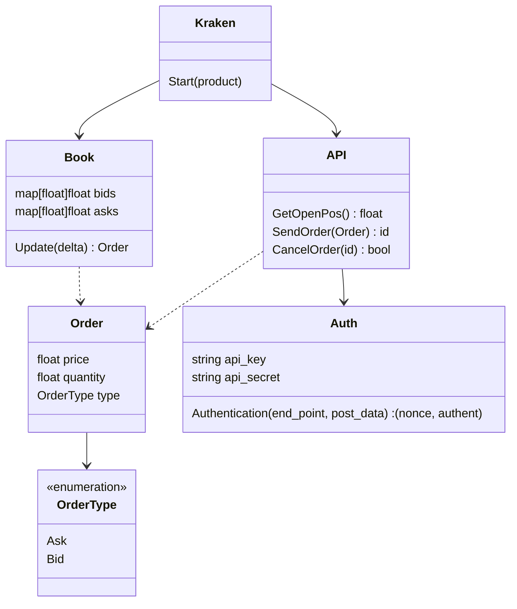

# Kraken Futures API Demo

[](https://golang.org)


## Introduction


A [*Kraken Futures*](https://futures.kraken.com) API demo, including authentication, book updating, sending and canceling orders.

```console
2022/09/13 20:38:06 {Price:20305.5 Quantity:80135 Type:Ask}
2022/09/13 20:38:09 {Price:20299.5 Quantity:0 Type:Ask}
2022/09/13 20:38:10 {Price:20300.5 Quantity:21654 Type:Ask}
2022/09/13 20:38:11 {Price:20317.5 Quantity:22965 Type:Ask}
2022/09/13 20:38:11 {Price:20508 Quantity:0 Type:Ask}
2022/09/13 20:38:12 {Price:20507 Quantity:81087 Type:Ask}
2022/09/13 20:38:12 {Price:20086 Quantity:0 Type:Bid}
2022/09/13 20:38:13 {Price:20320 Quantity:5172 Type:Ask}
```

## Getting Started

### Prerequisites

- Install [*Go*](https://golang.org).
- Set the API key in the `src/authkey` folder if you need to control orders.

### Building

Set the location to the `src` folder and run:

```bash
go build -tags debug
```

Or

```bash
go build -tags release
```

Note that the debug version and the release version use different URLs.

- `src/client/api/url_debug.go`

  ```go
  const WsURL string = "wss://demo-futures.kraken.com/ws/v1"
  const RestURL string = "https://demo-futures.kraken.com"
  ```

- `src/client/api/url_release.go`

  ```go
  const WsURL string = "wss://futures.kraken.com/ws/v1"
  const RestURL string = "https://futures.kraken.com"
  ```

## Class Diagram



## License

Distributed under the *MIT License*. See `LICENSE` for more information.