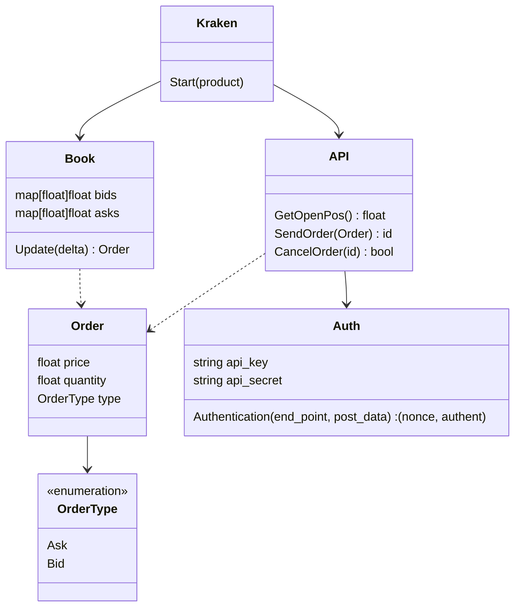

# Kraken Futures API Demo

[](https://golang.org)


## Introduction


A [*Kraken Futures*](https://futures.kraken.com) API demo, including authentication, book updating, sending and canceling orders.

## Getting Started

### Prerequisites

- Install [*Go*](https://golang.org).
- Set the API key in the `src/authkey` folder.

### Building

```bash
go build -tags debug
```

Or

```bash
go build -tags release
```

## Class Diagram


```mermaid
classDiagram

class OrderType {
    <<enumeration>>
    Ask
    Bid
}

class Order {
    float price
    float quantity
    OrderType type
}

Order --> OrderType

class Book {
    map[float]float bids
    map[float]float asks
    Update(delta) Order
}

Book ..> Order

class Auth {
    string api_key
    string api_secret

    Authentication(end_point, post_data) : (nonce, authent)
}

class API {
    GetOpenPos() float
    SendOrder(Order) id
    CancelOrder(id) bool
}

API --> Auth
API ..> Order

class Kraken {
    Start(product)
}

Kraken --> Book
Kraken --> API
```

## License

Distributed under the *MIT License*. See `LICENSE` for more information.

## Contact

- ***Chenzs108***

  > ***GitHub***: https://github.com/czs108
  >
  > ***E-Mail***: chenzs108@outlook.com
  >
  > ***WeChat***: chenzs108

- ***Liugw***

  > ***GitHub***: https://github.com/lgw1995
  >
  > ***E-Mail***: liu.guowen@outlook.com